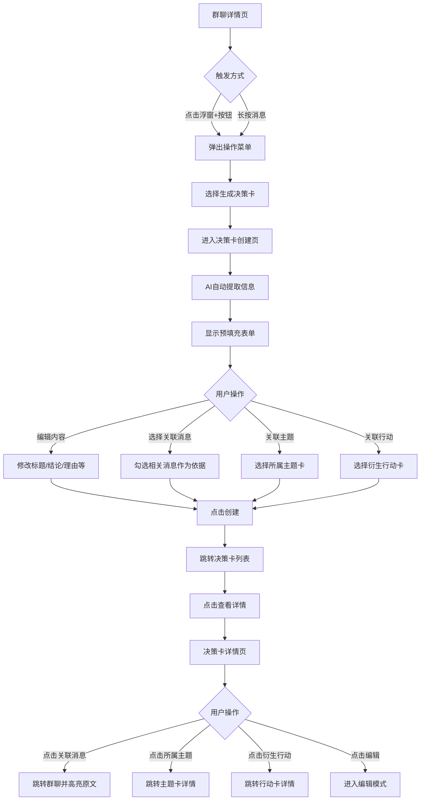
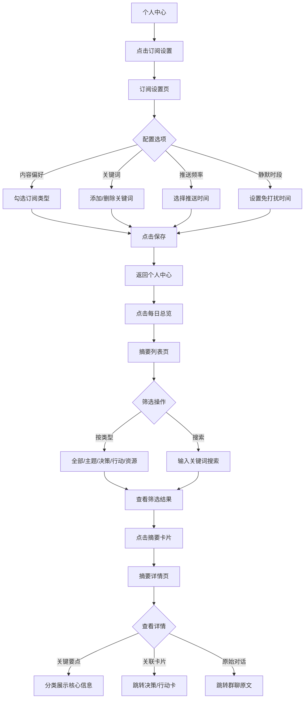
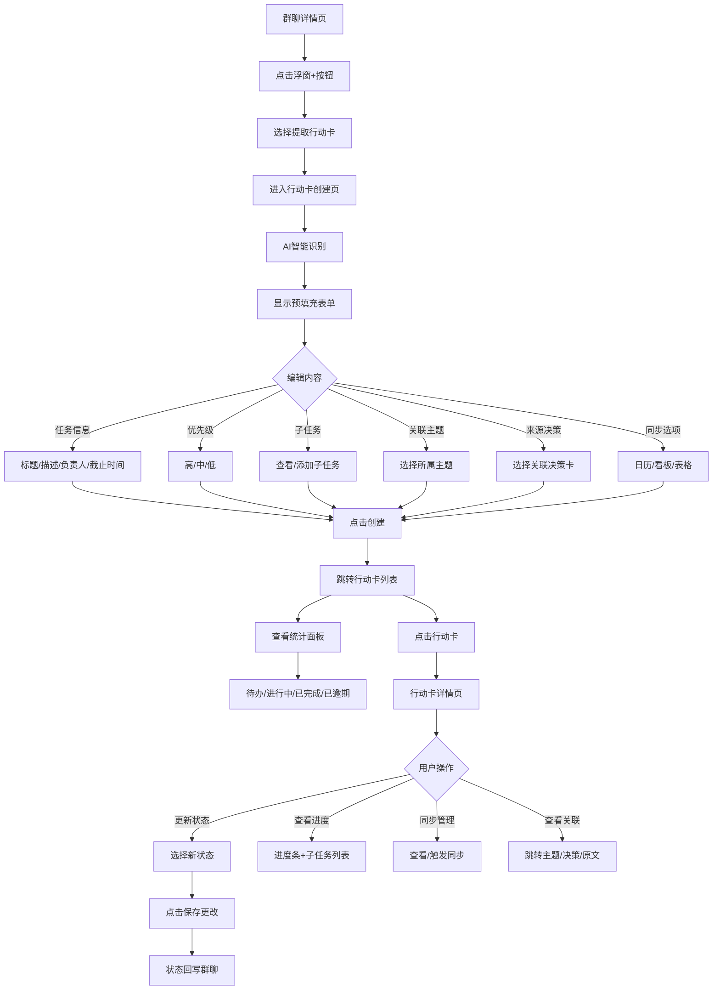

# 群聊信息结构化与任务管理工具

## 团队信息
- **团队名称：** 用户说得队
- **成员：** 张天成、戴于皓、赵轩、李易涵、金杨洋

## Figma 交互式原型链接
[https://civil-sway-02818456.figma.site/]

---

## 项目概述

这是一个iOS 风格移动端应用原型，旨在解决群聊信息过载问题。应用通过 AI 辅助提取群聊中的决策、行动项和主题，帮助用户高效管理群聊信息，实现信息的结构化和可追溯。


## 三项核心任务

### 任务一：可查证的决策卡

**任务描述：** 从群聊中提取决策信息，生成可追溯的决策卡，支持查看原文锚点、记录不同意见、编辑和更新决策内容。

**用户场景：** 在群聊讨论中，当团队达成某个决策时（例如"决定采用方案A，周五上线"），用户需要能够：
1. 自动或手动触发决策卡生成
2. AI 辅助提取关键信息（结论、理由、负责人、截止时间等）
3. 查看和编辑决策卡详情
4. 追溯决策依据的原文消息
5. 记录不同意见（赞同/反对/建议）

**完成路径：** 
```
群聊界面 → 长按消息/点击"+"按钮 → 选择"生成决策卡" → AI 自动填充 → 编辑确认 → 保存/更新 → 查看决策卡详情 → 点击锚点查看原文
```

**涉及页面：**
 - 群聊详情界面（消息列表、浮窗按钮、长按菜单）
 - 决策卡创建/编辑页（AI提取、表单编辑、消息关联）
 - 决策卡列表页（搜索、筛选、状态分类）
 - 决策卡详情页（完整信息、意见统计、关联消息锚点）

---

### 任务二：只看我相关微摘要

**任务描述：** 提供个性化的信息订阅和摘要功能，帮助用户快速获取与自己相关的信息，减少信息过载。

**用户场景：** 用户希望从大量群聊消息中快速获取与自己相关的关键信息，需要能够：
1. 设置订阅偏好（个人、消息摘要、每日任务、每周总览等）
2. 使用标签和分类组织信息
3. 快速定位重要任务和消息

**完成路径：** 
```
个人中心 → 配置订阅选项 → 返回查看摘要 → 筛选标签/分类 → 查看详细内容
```

**涉及页面：**
 - 个人中心（统计数据、快捷入口、设置菜单）
 - 订阅设置页（内容偏好、关键词管理、推送频率）
 - 摘要列表页（搜索、分类筛选、今日摘要统计）
- 摘要详情页（关键要点、关联卡片、原始对话）

---

### 任务三：行动抽取与同步

**任务描述：** 从群聊中自动识别和提取行动项，生成行动卡，并支持同步到外部工具（日历、看板、表格），同时支持状态回写到群聊。

**用户场景：** 在群聊中讨论任务分配时（例如"张三负责更新埋点，周五前完成"），用户需要能够：
1. 从消息中提取行动项（负责人、任务内容、截止时间）
2. 编辑和确认行动卡信息
3. 同步到日历、看板或表格工具
4. 更新任务状态并自动回写到群聊
5. 查看任务列表和筛选

**完成路径：** 
```
群聊界面 → 点击浮窗"+"按钮 → 选择"提取行动卡" → AI 识别填充 → 编辑确认 → 查看行动卡列表 → 更新状态 → 自动回写群聊
```

**涉及页面：**
- 群聊界面（浮窗"+"按钮、长按消息菜单）
- 行动卡创建页（AI识别、子任务拆解、同步选项）
- 行动卡列表页（状态统计、搜索筛选、优先级标识）
- 行动卡详情页（进度条、子任务、同步状态、状态更新）

---

## 主题卡模块

**功能描述：** 主题卡作为决策卡和行动卡的上层聚合，将相关讨论内容组织在一起，提供全局视图。

**涉及页面：**
 - 主题卡列表页（搜索、筛选、状态展示）
 - 主题卡详情页（摘要、关联决策、关联行动、关键消息）
- 主题卡创建页

---

## 页面结构与导航

```
 (主应用 - 底部标签栏导航)
├── (群聊列表)
│   └── (群聊详情)
│       ├──  (创建决策卡)
│       ├── (创建行动卡)
│       └── (创建主题卡)
├──  (主题卡列表)
│   └── (主题卡详情)
├──  (决策卡列表)
│   └──  (决策卡详情)
├── (行动卡列表)
│   └──  (行动卡详情)
└──  (个人中心)
    ├──  (通用设置)
    └──  (订阅设置)
```

### 底部标签栏
| 图标 | 标签 | 对应页面 |
|------|------|----------|
| 💬 | 群聊 | ChatsScreen |
| 🔖 | 主题卡 | ThemeCardsScreen |
| 📝 | 决策卡 | DecisionCardsScreen |
| ✅ | 行动卡 | ActionCardsScreen |
| 👤 | 我的 | ProfileScreen |

---

## 详细交互流程

### 流程一：创建决策卡



**关键交互点：**
1. **浮窗按钮** : 右下角蓝色圆形按钮，点击弹出操作菜单
2. **AI提取横幅** : 蓝色渐变横幅显示AI提取状态
3. **消息选择器**: 可多选关联消息，选中状态有蓝色边框和背景
4. **锚点跳转** : 点击关联消息可跳转原文并黄色高亮

---

### 流程二：配置订阅与查看摘要



**关键交互点：**
1. **内容偏好选择器** : 圆形复选框，支持多选
2. **关键词管理**: 输入框+添加按钮，标签式展示已添加关键词
3. **推送频率**: 单选按钮组，支持实时/每小时/每日/每周
4. **今日摘要卡片** : 蓝色渐变卡片显示统计数据
5. **分类筛选标签**: 横向滚动的圆角标签按钮

---

### 流程三：创建行动卡与同步



**关键交互点：**
1. **AI识别横幅** : 绿色渐变横幅显示识别状态
2. **优先级选择器**: 三个圆角按钮（高-红/中-橙/低-绿）
3. **子任务列表**: 圆形复选框+任务文本
4. **同步选项按钮**: 可多选，选中状态有蓝色背景
5. **状态统计面板** : 四列网格显示各状态数量
6. **进度条** : 蓝色填充的水平进度条
7. **状态选择器**: 2x2网格按钮，当前状态高亮

---

## 核心功能特性

### 1. AI 智能提取
- **决策卡**: 自动提取标题、结论、负责人、截止时间、决策理由
- **行动卡**: 自动识别任务内容、负责人、截止时间、子任务拆解
- **主题卡**: 自动生成主题摘要，聚合相关讨论

### 2. 锚点高亮系统
- 所有卡片都关联原始消息
- 点击关联消息可跳转到群聊详情页
- 目标消息以黄色背景高亮显示
- 自动滚动到消息位置

### 3. 卡片关联体系
```
主题卡 (Theme)
├── 决策卡 (Decision) [1:N]
│   └── 行动卡 (Action) [1:N]
└── 行动卡 (Action) [1:N]
```
- 主题卡聚合多个决策卡和行动卡
- 决策卡可衍生多个行动卡
- 行动卡可关联来源决策
- 双向导航，点击即可跳转

### 4. 外部工具同步
| 工具 | 图标 | 同步内容 |
|------|------|----------|
| 日历 | 📅 | 截止时间、任务标题 |
| 看板 | 📋 | 任务状态、负责人 |
| 多维表 | 📊 | 完整任务数据 |

### 5. 个性化订阅
- **内容偏好**: 只看与我相关、@提及、主题订阅、关键词订阅
- **推送频率**: 实时、每小时、每日早晨/晚间、每周汇总
- **静默时段**: 自定义免打扰时间段

---

## 视觉设计系统

### 颜色规范
| 用途 | 颜色值 | 说明 |
|------|--------|------|
| 主色 | #007AFF | iOS蓝，主要操作按钮 |
| 成功 | #34C759 | 已完成、同步成功 |
| 警告 | #FF9500 | 建议、依赖提示 |
| 错误 | #FF3B30 | 已逾期、高优先级 |
| 背景 | #F2F2F7 | 页面背景色 |
| 分割线 | #E5E5EA | 列表分割线 |
| 次要文字 | #8E8E93 | 辅助说明文字 |

### 状态颜色映射
| 状态 | 决策卡 | 行动卡 |
|------|--------|--------|
| 进行中 | 蓝色 #007AFF | 蓝色 #007AFF |
| 已完成 | 绿色 #34C759 | 绿色 #34C759 |
| 已逾期 | 红色 #FF3B30 | 红色 #FF3B30 |
| 待办 | - | 灰色 #8E8E93 |
| 已搁置 | - | 灰色 #8E8E93 |

### 组件样式
- **卡片**: 圆角 16px (rounded-2xl)，白色背景，轻微阴影
- **按钮**: 圆角 9999px (rounded-full) 或 12px (rounded-xl)
- **输入框**: 圆角 8px (rounded-lg)，灰色背景 #F2F2F7
- **标签**: 圆角 9999px，小号文字，彩色背景

---

## 评估者上下文信息

### 目标用户群体

**主要用户：** 需要频繁在群聊中进行协作和决策的团队成员

**典型使用场景：**
- **工作团队群：** 项目讨论、任务分配、决策记录、进度追踪
- **家校群：** 作业通知、活动安排、重要决策、家长反馈
- **社区群：** 报修处理、活动组织、公共事务决策、邻里协调

**用户痛点：**
- 群聊消息量大，重要信息容易被淹没
- 决策过程难以追溯，事后难以确认"当时说了什么"
- 任务分配口头化，缺乏系统性记录和跟踪
- 不同成员关注点不同，需要个性化的信息筛选

### 使用场景

**使用时机：**
- 群聊讨论过程中实时提取决策和任务
- 每日/每周定期查看摘要和任务列表
- 需要回顾历史决策时查找决策卡
- 任务状态变更时更新并同步

**使用设备：** 主要面向移动端（手机），屏幕尺寸 440px × 956px

**前提条件：**
- 用户已登录系统
- 用户已加入相关群聊
- 用户个人信息已完善（用于识别"与我相关"的内容）

### 原型功能范围

**已实现的功能：**
- 三个核心任务的完整交互流程
- 主题卡模块（新增的全局视图功能）
- 页面间的导航和跳转（支持返回栈）
- 基本交互元素（按钮、输入框、列表、开关等）
- AI 辅助信息提取的结果展示
- 外部工具同步选项的界面展示
- 决策卡/行动卡/主题卡的创建、编辑、查看流程
- 订阅设置和摘要筛选功能
- 锚点高亮跳转功能
- 卡片间的关联导航

**未实现的功能（假设已完成）：**
- 用户登录/注册流程
- 个人信息设置页面
- 群聊的基础聊天功能（发送消息、表情等）
- 实际的 AI 处理逻辑（原型中展示为预设的示例结果）
- 外部工具（日历、看板、表格）的实际连接和数据同步
- 消息推送和通知功能
- 数据持久化存储

### 设计限制与假设

**数据限制：**
- 使用固定的示例数据（mockData），不包含真实的数据加载逻辑
- 列表内容为预设，不会动态更新
- 状态变更仅在当前会话有效

**交互限制：**
- 点击按钮会跳转到对应页面
- 输入框可以展示输入状态，但不会实际处理输入内容
- 列表项可以点击查看详情，但数据不会动态变化
- 开关组件可以展示开/关状态

### 评估重点

评估者在测试原型时，请重点关注以下方面：

1. **任务完成度：** 是否能够通过原型完成三个核心任务的完整流程
2. **导航清晰度：** 页面跳转是否直观，返回路径是否明确，用户是否会迷失
3. **信息架构：** 信息组织是否合理，关键功能是否易于发现和理解
4. **交互反馈：** 操作是否有明确的视觉反馈，用户是否知道当前状态
5. **视觉层次：** 布局、间距、对齐是否清晰，信息优先级是否明确
6. **移动端适配：** 是否符合移动端使用习惯，点击区域是否足够大
7. **学习成本：** 新用户是否能快速理解如何使用各项功能
8. **卡片关联：** 主题卡、决策卡、行动卡之间的关联是否清晰易懂

---
