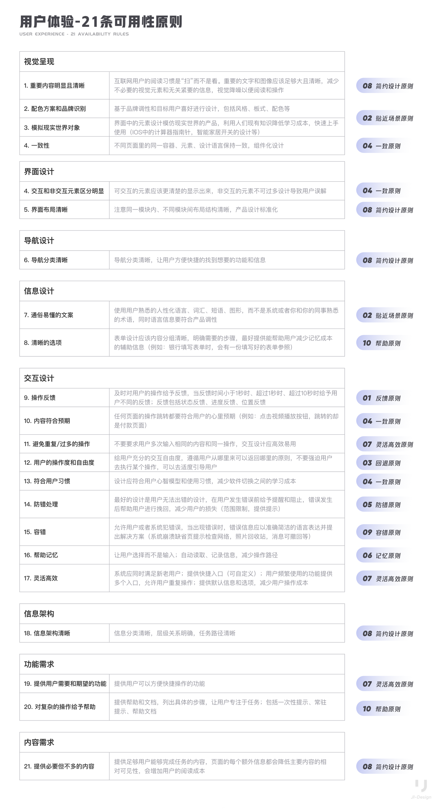

# 启发式评估记录表

**原型小组：**  
**评估小组：**  
**评估人：**

---

请将您发现的用户体验相关问题填入表格内（可以在 21 条之外加入**AI 相关的原则**和个人经验原则）

| 序号 | 问题位置 | 可用性原则 | 严重程度等级 | 问题描述 | 解决方案（原型小组） |
| :--: | :------: | :--------: | :----------: | :------: | :------------------: |
|  1   |          |            |              |          |                      |
|  2   |          |            |              |          |                      |
|  3   |          |            |              |          |                      |
|  4   |          |            |              |          |                      |
|  5   |          |            |              |          |                      |
|  6   |          |            |              |          |                      |
|  7   |          |            |              |          |                      |
|  8   |          |            |              |          |                      |
|  9   |          |            |              |          |                      |
|  10  |          |            |              |          |                      |

---

## 严重程度等级

| 等级 | 描述                                     |
| :--: | :--------------------------------------- |
|  4   | 灾难性问题，紧急，产品发布前必须解决     |
|  3   | 较大的问题，修正，并优先级极高           |
|  2   | 较小的问题，修正但优先级低               |
|  1   | 锦上添花的问题，有多余的时间人力才去修正 |
|  0   | 这根本不是一个可用性问题                 |

---

## 尼尔森十大启发式原则参考

